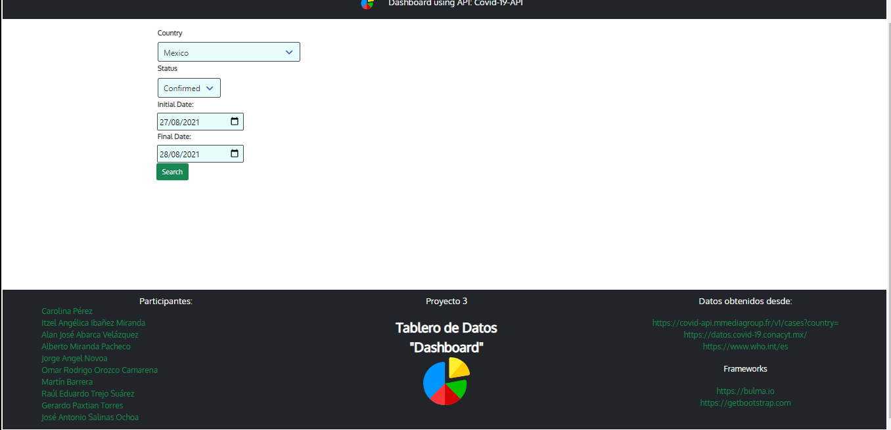
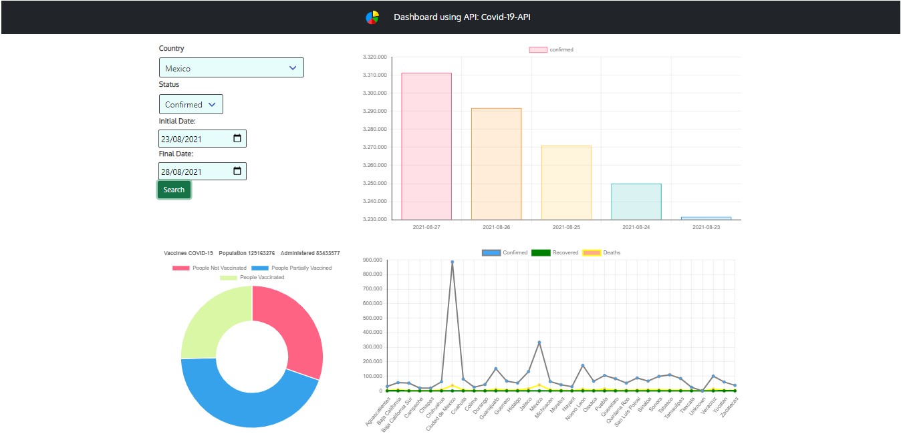

# PROYECTO 3: Tablero de Datos ("Dashboard")

## **ÍNDICE**

* [1. Intro](#1-intro)
* [2. BackEnd](#2-BackEnd)
* [3. FrontEnd](#3-FrontEnd)
* [4. Operation](#4-Operation)
* [5. Demo](#5-Demo)
* [6. Parnerts](#6-Partners)

## 1. Intro

Desarrollar una aplicación realizando una conexión a un API (financiera, educativa, social) y presentar datos en una interfaz.

Para este proyecto se utiliza la API de COVID-19, Aquí puede ver la descripción de la misma:
"https://github.com/M-Media-Group/Covid-19-API"

## 2. BackEnd

1. Crear carpeta back
2. Iniciar proyecto
   npm init -y
3. Crear archivo con el nombre "getDataCovid.js"
4. Configurar package.json
    - Agregar línea: "type": "module"
    - Agregar llamado del script en sección scripts: "server": "node ./back/getDataCovid.js"
    - Agregar dependencias:
        - express : npm i express
        - dotenv : nmp i dotenv
        - axios : npm i axios
        - cors : npm i cors
5. Configurar .env
    - Agregar puerto : PORT=3000
    - Agregar baseUrl: API_BASE_URL="https://covid-api.mmediagroup.fr"
    - Agregar url: API_URL="/v1/%value%?"
6. Generar listener para:
    - /stats : Responde a información general de un país acerca de status confirmed, deaths and recovered
               El status recovered ya no esta siendo actualizado
    - /hist : Responde a información de un pais por status e histórico de fechas
    - /vac : Responde a información sobre la población inoculada de un país en especifíco
7. Ejecutar Server
    - Dentro de la carpeta back ejecutar el siguiente comando: npm run server

8. Después de descargar los archivos se debe considerar lo siguiente:
    - Ejecutar el comando: npm i o npm install
    - Agregar el archivo .env para que la configuración pueda ser parseada y leída

    
## 3. FrontEnd

1. Generar carpeta front
2. Crear archivo app.js
3. Crear archivo index.html
4. Crear archivo styles.css
5. Archivo app.js
    - Función addOptions
        - Permite obtener datos de los países para alimentar el dropdown del input Country 
    - Función getData
        - Realiza los llamados a /stats, /hist & /vac
6. Archivo index.html
    - Agregar CDN de boostrap: https://cdn.jsdelivr.net/npm/bootstrap@5.1.0/dist/css/bootstrap.min.css
    - Agregar script de axios: https://cdn.jsdelivr.net/npm/axios/dist/axios.min.js
    - Agregar script de Chart.js: https://cdn.jsdelivr.net/npm/chart.js@3.5.1/dist/chart.min.js
    - Agregar script app.js: ''
7. Archivo styles.css
    - Agregar estilos para la forma y spinner

## 4. Operation

1. Seleccionar una opción del listado "Country"
2. Seleccionar una opción del listado "Status"
    - Recordar que el status "Recovered" ha dejado de ser actualizado 
3. Por default se coloca el valor del día actual menos 1 al campo Initial Date
4. Por default se coloca el valor del día actual en el campo Final Date
5. Dar click al botón "Search"
    - Se mostrarán 3 gráficas:
        - Gráfica de tipo Barra
          Muestra los datos del Status seleccionado para el periodo indicado en las fechas Initial Date y Final Date.
        - Gráfica de tipo Doughnut
          Muestra los siguientes datos:
            - Población con el esquema completo de inoculación
            - Población con el esquema incompleto de inoculación
            - Población que no ha sido inoculada
        - Gráfica de tipo Línea
          Muestra la cantidad de población en cada uno de los Status para cada estado del país seleccionado

## 5. Demo

Muestra Pantalla inicial con los campos a requisitar para poder realizar la consulta

Muestra del resultado de la consulta a través del API COVID-19

Para visualizar el demo dar click en el siguiente enlace:
- https://aabarca7.github.io./

## 6. Partners

- Team 2
    - Carolina Pérez
    - Itzel Angélica Ibañez Miranda
    - Alan José Abarca Velázquez
    - Alberto Miranda Pacheco
    - Gerardo Paxtian Torres
    - Jorge Angel Novoa
    - Martín Barrera
    - Omar Rodrigo Orozco Camarena
    - Raúl Eduardo Trejo Suárez
    - José Antonio Salinas Ochoa
